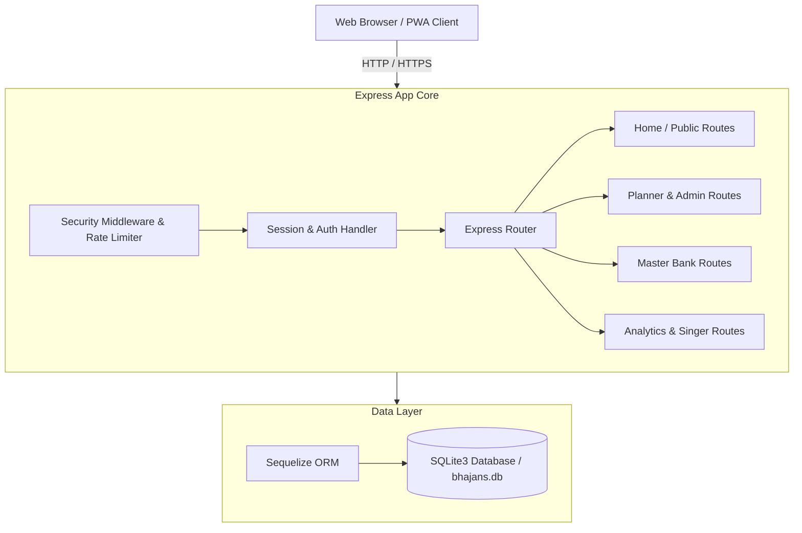

# 🕉️ Bhajan Scheduler

[](https://nodejs.org/)
[](https://expressjs.com/)
[](https://www.sqlite.org/)
[](#-pwa--offline-capabilities)
[](#-deployment-railway)
[](LICENSE)

> A modern, full-stack Progressive Web Application (PWA) for managing, planning, and organizing bhajan sessions for the **Sri Sathya Sai Seva Organisation, Gandhinagar**. 

---

## 📌 Table of Contents

- [Overview](#-overview)
- [Key Features](#-key-features)
- [Tech Stack](#-tech-stack)
- [Application Architecture](#-application-architecture)
- [Directory Structure](#-directory-structure)
- [Quick Start](#-quick-start)
- [Environment Variables](#-environment-variables)
- [Route Navigation Map](#-route-navigation-map)
- [PWA & Offline Capabilities](#-pwa--offline-capabilities)
- [Security & Rate Limiting](#-security--rate-limiting)
- [Deployment (Railway)](#-deployment-railway)
- [Contributing](#-contributing)
- [License](#-license)

---

## 🕉️ Overview

**Bhajan Scheduler** is built to streamline the workflow of organizing weekly and special bhajan sessions. It empowers devotees to submit song preferences, helps coordinators curate balanced program schedules according to traditional deity sequencing rules, provides an extensive searchable bank of over 6,000+ bhajans, and maintains singer participation records.

---

## ✨ Key Features

### 📋 Devotee Submissions & Live Plan View
- **Public Submission Portal** (`/submit-form`): Allows devotees to submit bhajan requests for upcoming scheduled sessions.
- **Live Program Plan** (`/plan-view`): Real-time view of finalized session lineups for singers, instrumentalists, and attendees.

### 🛠️ Admin Control Center
- **Session Management** (`/admin`): Create, lock, edit, and publish bhajan sessions.
- **Deity Rule Engine**: Configure deity sequencing rules and constraints to ensure balanced spiritual programs.
- **Submission Moderation**: Review, approve, reject, or re-order devotee song submissions.
- **User & Role Management** (`/admin/admin-users`): Granular admin user accounts with role-based permissions.

### 📚 Master Bhajan Bank (6,000+ Bhajans)
- **Extensive Database** (`/master-bank`): Centralized library containing 6,000+ bhajans enriched with metadata.
- **Advanced Filtering & Search**: Filter by **Deity**, **Raga**, **Tempo**, **Pitch / Scale**, and **Language**.
- **CRUD & Management**: Add new bhajans, edit existing entries, and manage data templates.

### 🎤 Singer Dictionary & Roster Management
- **Singer Profiles** (`/singers`): Track active singers, singing frequency, and historical song assignments.
- **Availability Tracking**: Prevent over-scheduling and ensure equitable singing opportunities.

### 📊 Analytics & System Audit Logs
- **Activity Tracker** (`/analytics`): Real-time tracking of session creation, song additions, user logins, and administrative actions.
- **Usage Statistics**: Visualize session trends, top sung bhajans, and active participant metrics.

### 📱 Progressive Web App (PWA) & Offline Mode
- **Installable Desktop/Mobile App**: Standalone PWA experience with custom install prompts.
- **Offline Resiliency**: Built-in Service Worker (`/sw.js`) and offline fallback page (`offline.html`) for uninterrupted access during network drops.

---

## 🛠️ Tech Stack

### Core Frameworks & Libraries
- **Runtime**: [Node.js](https://nodejs.org/) (v18+)
- **Server Framework**: [Express.js](https://expressjs.com/) (v5)
- **Templating Engine**: EJS with `express-ejs-layouts`
- **Database ORM**: [Sequelize](https://sequelize.org/) with [SQLite3](https://www.sqlite.org/)
- **Authentication**: `bcrypt` password hashing + Google OAuth 2.0 (`google-auth-library`)
- **Session Management**: `express-session` with `connect-session-sequelize` store

### Frontend & PWA
- **Styling**: Modern Vanilla CSS, responsive layouts, glassmorphism UI elements
- **Interactivity**: Vanilla JavaScript ES6+
- **PWA Capabilities**: Service Worker, Web App Manifest, Cache Storage API

---

## 🏗️ Application Architecture



---

## 📁 Directory Structure

```
Bhajan_Schedular/
├── app.js                   # Express application entry point & setup
├── convert.js               # Database/Data conversion utilities
├── migrate-layouts.js       # Layout migration script
├── templates.js             # View and template helpers
├── railway.json             # Railway cloud deployment configuration
├── config/                  # Sequelize and environment configuration
├── controllers/             # Request handlers & logic
├── database/               # Database initialization & migrations
├── middleware/              # Security, tracking, and auth middlewares
├── models/                  # Sequelize data models
├── public/                  # Static assets (CSS, JS, PWA Service Worker)
│   ├── css/                 # Custom stylesheet files
│   ├── js/                  # Client-side scripts & PWA installer
│   ├── manifest.json        # Web App Manifest definition
│   ├── sw.js                # Service Worker for offline caching
│   └── offline.html         # Offline fallback screen
├── routes/                  # Application route handlers
│   ├── admin.js             # Admin dashboard & session management
│   ├── adminUsers.js        # Admin user accounts management
│   ├── analytics.js         # System logs & analytics metrics
│   ├── api.js               # JSON API endpoints
│   ├── auth.js              # Password & Google OAuth routes
│   ├── home.js              # Public submit form & landing routes
│   ├── masterBank.js        # Master Bhajan Bank routes
│   ├── planner.js           # Bhajan planning & layout routes
│   └── singer.js            # Singer dictionary routes
├── services/                # Business logic services
├── views/                   # EJS templates and layouts
│   └── layouts/             # Main EJS wrapper layouts
└── README.md                # Project documentation
```

---

## 🚀 Quick Start

### Prerequisites
- **Node.js**: `v18.0.0` or higher
- **npm**: `v9.0.0` or higher

### Step-by-Step Installation

1. **Clone the repository:**
   ```bash
   git clone https://github.com/vedasoham/Bhajan_Schedular.git
   cd Bhajan_Schedular
   ```

2. **Install project dependencies:**
   ```bash
   npm install
   ```

3. **Configure environment variables:**
   ```bash
   cp .env.example .env
   ```
   *Open `.env` and set your desired admin credentials and secret keys.*

4. **Start the application:**

   - **Development Mode** (with auto-reload via nodemon):
     ```bash
     npm run dev
     ```

   - **Production Mode**:
     ```bash
     npm start
     ```

5. **Open in browser:**
   Navigate to [http://localhost:8000](http://localhost:8000) in your web browser.

---

## 🔑 Environment Variables

Create a `.env` file in the root directory based on `.env.example`:

| Variable | Required | Default | Description |
| :--- | :---: | :---: | :--- |
| `PORT` | ❌ | `8000` | Port number on which the server listens. |
| `NODE_ENV` | ❌ | `development` | Set to `production` for production environments. |
| `SESSION_SECRET` | ✅ | *Generated* | Secret key for signing session cookies. |
| `SUPER_ADMIN_USER` | ✅ | `admin` | Initial super admin username created on startup. |
| `SUPER_ADMIN_PASS` | ✅ | `admin123` | Initial super admin password. |
| `SUPER_ADMIN_DISPLAY_NAME` | ❌ | `Super Admin` | Display name for the super admin account. |
| `DB_PATH` | ❌ | `./bhajans.db` | Absolute or relative path to the SQLite database. |
| `GOOGLE_CLIENT_ID` | ❌ | - | Google OAuth Client ID for optional Google Sign-In. |

---

## 🗺️ Route Navigation Map

| Section | Route Path | Description |
| :--- | :--- | :--- |
| **Public** | `/submit-form` | Devotee form for submitting upcoming bhajan preferences. |
| **Public** | `/plan-view` | Public live view of the finalized session schedule. |
| **Auth** | `/admin-login` | Admin authentication login portal. |
| **Auth** | `/forgot-password` | Account recovery flow for admin users. |
| **Admin** | `/admin` | Main Admin Dashboard for managing sessions & submissions. |
| **Admin** | `/admin/admin-users` | Manage administrator accounts, roles, and access. |
| **Bhajans** | `/master-bank` | Browse, search, filter, and manage 6,000+ master bhajans. |
| **Singers** | `/singers` | Singer dictionary, roster assignment, and availability tracker. |
| **Analytics** | `/analytics` | System activity logs, session metrics, and usage statistics. |

---

## 📱 PWA & Offline Capabilities

Bhajan Scheduler includes full Progressive Web App support out of the box:
- **Offline Caching**: The service worker (`/sw.js`) caches static assets and essential pages so users can access song lyrics and session info offline.
- **Offline Fallback**: Displays a gracefully styled offline page (`offline.html`) when network connectivity is lost.
- **PWA Installation**: Prompts users with an inline, non-intrusive install banner to add the app to home screens on iOS, Android, and Desktop devices.

---

## 🔒 Security & Rate Limiting

The app incorporates security best practices:
- **Security Headers**: Custom CSP policies, frame-options, XSS protection, and MIME type sniffing protection (`middleware/security.js`).
- **Anti-CSRF & Cross-Site Write Blocking**: Protects mutative actions (`POST`, `PUT`, `DELETE`) from unauthorized cross-site invocations.
- **Rate Limiting**: Limits write request bursts to protect against brute-force attacks.
- **Payload Caps**: Enforces strict `100kb` body size limits to prevent payload bloat attacks.
- **Secure Sessions**: HTTP-only, SameSite-protected cookies.

---

## ☁️ Deployment (Railway)

The application is pre-configured for seamless cloud deployment on [Railway](https://railway.app/).

1. **Connect Repository**: Link your GitHub repository (`Bhajan_Schedular`) to a new Railway project.
2. **Attach Persistent Storage Volume**:
   - Add a **Volume** in Railway mounted to `/data`.
   - *This ensures database entries persist across redeployments.*
3. **Configure Environment Variables in Railway**:
   - Set `NODE_ENV=production`
   - Set `DB_PATH=/data/bhajans.db`
   - Set `SUPER_ADMIN_USER`, `SUPER_ADMIN_PASS`, and `SESSION_SECRET`
4. **Deploy**: Railway automatically detects `railway.json` and executes `npm start`.

---

## 🤝 Contributing

Contributions, bug reports, and feature requests are welcome!

1. Fork the Project repository
2. Create your Feature Branch (`git checkout -b feature/AmazingFeature`)
3. Commit your Changes (`git commit -m 'Add some AmazingFeature'`)
4. Push to the Branch (`git push origin feature/AmazingFeature`)
5. Open a Pull Request

---

## 📄 License

Distributed under the **ISC License**. See `LICENSE` for more information.

***

<p center>
  <i>Developed with devotion for Sri Sathya Sai Seva Organisation, Gandhinagar. 🕉️</i>
</p>